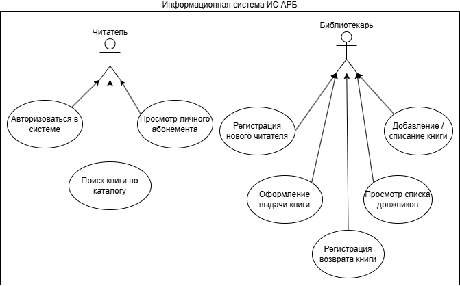
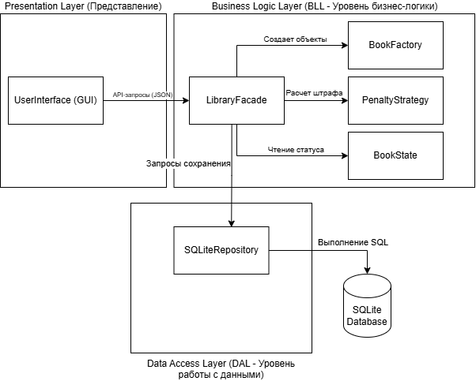

# 📚 Проектирование архитектуры информационной системы библиотеки (ИС АРБ)

Курсовой проект, посвященный системному анализу и объектно-ориентированному проектированию (ООП) локальной информационной системы для автоматизации работы малых учебных и муниципальных библиотек. 

> 📖 **Полный текст исследования, спецификации и расчеты** доступны в файле `Курсовая-по-архитектуре-ПО.pdf` в директории [`docs/`](docs/).

## 🎯 Цели и задачи проектирования

Традиционный учет библиотечных фондов сопровождается высокой трудоемкостью (поиск бумажной карточки занимает до 5 минут) и частыми ошибками в журналах задолженностей. Цель данного проекта — разработать масштабируемую архитектуру программного решения, которая позволит:
* Сократить время обслуживания читателя на 40-55%.
* Снизить количество ошибок при оформлении выдачи на 60-70%.
* Обеспечить константное время поиска $O(1)$ по фондам до 50 000 изданий.

## 🏗 Разработанная архитектура

Спроектирована **Многоуровневая архитектура (Layered Architecture)**, обеспечивающая жесткую изоляцию пользовательского интерфейса (Presentation Layer), доменной модели (Business Logic Layer) и механизмов СУБД SQLite (Data Access Layer).

### Применение паттернов (GoF)
Для обеспечения соответствия принципам **SOLID** в статическую структуру из 17 классов интегрировано 6 паттернов проектирования:
1. **Facade** (`LibraryFacade`) — единая точка входа для минимизации связности между подсистемами.
2. **Repository** (`SQLiteRepository`) — абстрагирование SQL-запросов и инверсия зависимостей (DIP).
3. **Strategy** (`IPenaltyStrategy`) — динамический расчет штрафов для разных категорий читателей без каскадных `if-else` (OCP).
4. **State** (`IBookState`) — контроль жизненного цикла книги (`Available`, `Borrowed`) для исключения коллизий на уровне архитектуры.
5. **Observer** (`IObserver`) — слабосвязанная событийная рассылка уведомлений.
6. **Factory Method** (`BookFactory`) — инкапсуляция логики инициализации и безопасное управление памятью.

## 📸 UML-моделирование

В рамках проекта разработаны визуальные модели поведения и структуры системы. 

  
<b>Посмотреть UML-диаграмму вариантов использования (Use Case)</b>

  
  
  *Модель разграничения прав доступа между Читателем и Библиотекарем.*

  
<b>Посмотреть диаграмму компонентной архитектуры</b>

  
  
  *Взаимодействие слоев представления, бизнес-логики и базы данных.*

  
<b>Посмотреть блок-схему бизнес-процесса возврата</b>

  
  
  *Алгоритм расчета дельты времени и применения динамической стратегии начисления пени.*

