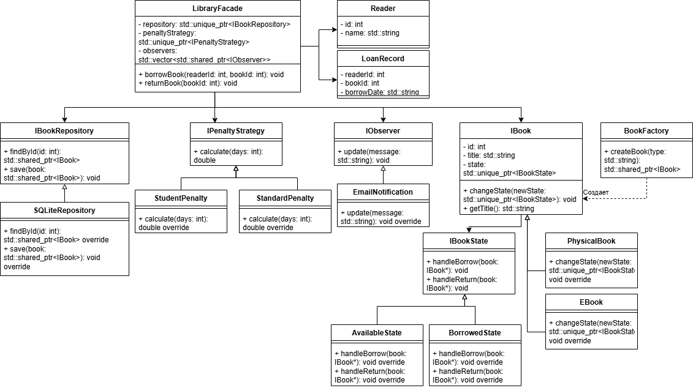
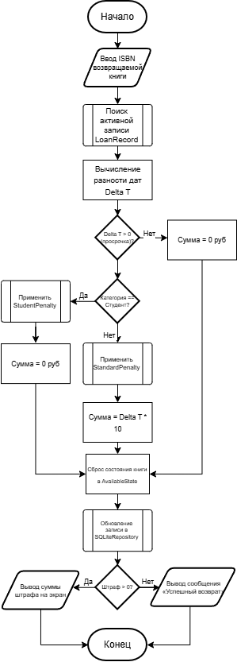

# 📚 Проектирование архитектуры информационной системы библиотеки (ИС АРБ)

Курсовой проект, посвященный системному анализу и объектно-ориентированному проектированию (ООП) локальной информационной системы для автоматизации работы малых учебных и муниципальных библиотек. 

> 📖 **Полный текст исследования, спецификации и расчеты** доступны в файле `Курсовая-по-архитектуре-ПО.pdf` в директории [`docs/`](docs/).

## 🎯 Цели и задачи проектирования

Традиционный учет библиотечных фондов сопровождается высокой трудоемкостью (поиск одной бумажной карточки занимает до 5 минут) и частыми ошибками в журналах задолженностей. Цель данного проекта — разработать масштабируемую архитектуру программного решения , которая позволит:
* Сократить время обслуживания читателя на 40-55% .
* Снизить количество ошибок при оформлении выдачи и возврата документов на 60-70% .
* Повысить пропускную способность абонемента библиотеки на 25-30% .
* Обеспечить константное время поиска $O(1)$ по фондам до 50 000 изданий .
* Гарантировать время отклика на поисковый запрос $\le\sim50$ мс для комфортного обслуживания очередей .

## 💻 Технологический стек и база данных
Выбор технологий научно обоснован требованиями производительности и надежности :
* **Язык программирования:** С++ (стандарт С++14/17) с использованием умных указателей (`std::unique_ptr`) и идиомы RAII для детерминированного управления памятью без риска утечек в операционной системе .
* **Структуры данных:** Применение контейнеров стандартной библиотеки шаблонов (STL), в частности хеш-таблиц `std::unordered_map` .
* **База данных:** Встраиваемая локальная СУБД SQLite, обеспечивающая транзакционную целостность и автономную работу прототипа без развертывания веб-серверов .

## 🏗 Разработанная архитектура

Спроектирована **Многоуровневая архитектура (Layered Architecture)**, обеспечивающая жесткую изоляцию пользовательского интерфейса (Presentation Layer), доменной модели (Business Logic Layer) и механизмов СУБД SQLite (Data Access Layer) .

### Применение паттернов (GoF)
Для обеспечения соответствия принципам **SOLID** в статическую структуру из 17 классов интегрировано 6 паттернов проектирования :
1. **Facade** (`LibraryFacade`) — единая точка входа для минимизации связности между подсистемами (СВО) .
2. **Repository** (`SQLiteRepository`) — абстрагирование SQL-запросов и обеспечение проведения модульного тестирования изолированно от физического хранилища .
3. **Strategy** (`IPenaltyStrategy`) — динамический расчет штрафов для разных категорий читателей без сложных каскадных ветвлений `if-else` (сохранение принципа OCP) .
4. **State** (`IBookState`) — строгий контроль жизненного цикла книги (`Available`, `Borrowed`, «На реставрации») для исключения логических коллизий на уровне архитектуры .
5. **Observer** (`IObserver`) — слабосвязанная реактивная рассылка уведомлений .
6. **Factory Method** (`BookFactory`) — инкапсуляция логики инициализации и централизованное управление выделением динамической памяти .

### Интеграция принципов SOLID
Проведенная в проекте верификация архитектуры подтверждает строгое следование стандартам ООП :
* **S (Single Responsibility):** Логика хранения отделена от представления данных путем разделения на сущности (`Book`, `Reader`) и репозитории .
* **O (Open/Closed):** Добавление новых правил расчета штрафов (льгот) производится без модификации базового кода благодаря паттерну Стратегия .
* **L (Liskov Substitution):** Все подклассы (разные категории читателей) корректно замещают базовый абстрактный класс `IReader` .
* **I (Interface Segregation):** Разделение интерфейсов на узкоспециализированные (`IReaderActions` и `IAdminActions`) для повышения безопасности системы .
* **D (Dependency Inversion):** Высокоуровневые бизнес-сервисы зависят исключительно от интерфейса `IRepository`, а не от конкретной реализации СУБД .

## 📄 Структура выходной информации и отчетность
Выходной информацией спроектированной системы являются отчетные данные и экранные формы . Система формирует следующие ключевые артефакты:
* **Электронная квитанция транзакции (`LoanRecord`)**: содержит уникальный ID операции, временную метку, ID читателя, ISBN книги и плановую дату возврата .
* **Детализированная справка по задолженности**: выгружается при фиксации просроченного возврата; содержит информацию о примененной стратегии штрафа и итоговой сумме, подлежащей оплате .
* **Сводная аналитика по должникам**: экспорт стандартизированных данных для передачи в бухгалтерию в форматах CSV или PDF .

## 🚀 Перспективы развития
Спроектированный архитектурный каркас обладает гибкостью для дальнейшего масштабирования. Базовая архитектура позволяет без существенной переработки исходного кода:
* Интегрировать систему с внешними электронными каталогами и государственными реестрами .
* Добавить веб-интерфейс для удаленного доступа .
* Расширить аналитическую подсистему средствами прогнозирования спроса на литературу .

## 📸 UML-моделирование

В рамках проекта разработаны визуальные модели поведения и структуры системы. 

  
<b>Посмотреть UML-диаграмму вариантов использования (Use Case)</b>

  
  
  *Модель разграничения прав доступа между Читателем и Библиотекарем .*

  
<b>Посмотреть UML-диаграмму классов системы</b>

  
  
  *Статическая структура из 17 классов, распределенных по уровням приложения и отражающих доменные сущности и сервисные компоненты .*

  
<b>Посмотреть диаграмму компонентной архитектуры</b>

  
  
  *Взаимодействие слоев представления, бизнес-логики и базы данных .*

  
<b>Посмотреть блок-схему бизнес-процесса возврата</b>

  
  
  *Алгоритм расчета дельты времени и применения динамической стратегии начисления пени .*

